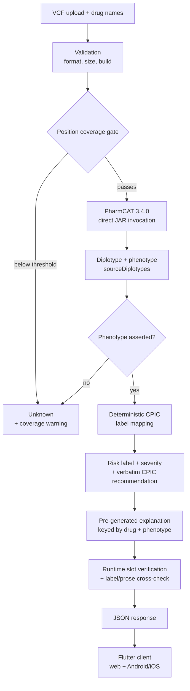

# Pharmacogenomic Risk Prediction System (PharmaGuard)

Analyses a patient's genetic data (VCF) against a prescribed drug and returns a pharmacogenomic risk assessment, a CPIC-aligned clinical recommendation, and a plain-language explanation.

> **⚠️ Research and educational use only. This is not a medical device and is not for clinical use.** No output from this system should be used to make a prescribing decision. Consult a qualified clinician or genetic counsellor.

---

## Table of contents

- [What this project is](#what-this-project-is)
- [Key results](#key-results)
- [Architecture](#architecture)
- [Field authorship](#field-authorship)
- [The verification model](#the-verification-model)
- [Tech stack](#tech-stack)
- [Method](#method)
- [Validation results](#validation-results)
- [Input requirements](#input-requirements)
- [Quickstart](#quickstart)
- [Running the demo](#running-the-demo)
- [Repository map](#repository-map)
- [Testing and release gates](#testing-and-release-gates)
- [Current status](#current-status)
- [Limitations](#limitations)
- [Team](#team)

---

## What this project is

Adverse drug reactions are a major cause of preventable harm, and a significant fraction are attributable to genetic variation in drug-metabolising enzymes. Pharmacogenomics maps that variation to prescribing guidance. The Clinical Pharmacogenetics Implementation Consortium (CPIC) publishes the guidelines; the problem is getting from a patient's raw genomic file to a recommendation a person can act on.

This system does that end to end for **7 pharmacogenes** and **6 drugs**:

| Gene | Drug |
|---|---|
| CYP2C19 | clopidogrel |
| CYP2C9 | warfarin |
| CYP2D6 | codeine |
| SLCO1B1 | simvastatin |
| TPMT (+ NUDT15) | azathioprine |
| DPYD | fluorouracil |

Risk labels: `Safe` · `Adjust Dosage` · `Toxic` · `Ineffective` · `Unknown`

### What makes it different

The project became two things. The first is the system above. The second — and the stronger contribution — is what happened when we measured it.

We built the system, then validated it exhaustively, and found **eight distinct ways that a pharmacogenomic pipeline silently produces false reassurance**: telling a user they are safe when the system does not actually know. Every defect found ran in the same direction. None ran the other way.

There is a structural reason, and it is the project's central claim:

> **In variant-based genomics, the reference allele is the low-risk state. Missing data is therefore not neutral — it reads as normal. Incomplete input produces false *confidence*, not uncertainty.**

The system's design is a response to that finding. It is built to decline rather than guess, and the verification architecture exists to enforce that.

---

## Key results

| Result | Value |
|---|---|
| CPIC label-mapping validation | **92/105** combinations, exhaustive (not sampled); 13 documented divergences, all erring toward caution |
| Integration fidelity | **100.0000%** — 400 samples, 2,800 gene-pairs, 5,600 field comparisons, 0 mismatches |
| PharmCAT adversarial test VCFs | **0 mismatches** across all 74 files |
| CYP2D6 negative control | **400/400** declined — never fabricated |
| Confident-label rate, complete-coverage input | **100%**, 0% wrong |
| Usable rate, polymorphic-filtered research slices | **12.58%** — a property of that input format, not a pipeline failure rate |
| External diplotype concordance | **n=1** (2/2 exact) — bounded, see [Limitations](#limitations) |
| South Asian (SAS) subgroup, n=75 | CYP2C19 reduced-function **53.3%**, second only to EAS |
| Backend tests | 560 passing |
| Client tests | 37 passing |

### The eight findings

1. **Lexical provenance checking is unsound *and* incomplete.** A term-overlap matcher passed a polarity-*reversed* claim ("Do NOT consider dose reduction" against a source saying "Consider dose reduction") while rejecting 15 of 16 faithful paraphrases.
2. **Assertion-marker rules are structurally blind to fabricated mechanisms.** A planted fabrication ("inhibited by grapefruit juice") contains no number, duration, or polarity marker, so no rule fires.
3. **Closed-vocabulary checking penalises plain language.** Applied to explanation text it produced a 57% false-positive rate (30% after POS narrowing) — flagging *genetic*, *properly*, *effectively*.
4. **Label/prose divergence.** Explanation→CPIC and label→CPIC were both verified, yet the two artifacts contradicted each other — because they trace to *different parts* of the same source. Pairwise verification against a common source does not guarantee mutual consistency.
5. **A category error between two PharmCAT structures.** `recommendationDiplotypes` is a lossy reduction for CPIC table lookup; `sourceDiplotypes` is what was actually called. Reading the former for both displayed "Normal Metabolizer" where PharmCAT said "Indeterminate" — manufacturing certainty the source explicitly withheld.
6. **A missing phenotype→label edge.** A phenotype PharmCAT declined to assert still found a CPIC table row, rendering a green *Safe* badge on fluorouracil. Fixing it as a general invariant changed **294 of 2,400** results, every one removing an unsupported confident label. A DPYD-specific patch would have left **293 of the 294** live.
7. **No-data vs indeterminate conflation, in three separate layers.** One instance silently collapsed `{Normal Function, Indeterminate}` to `{NM}`, asserted Safe, and *measured as a fix* while leaving 195 samples broken. Framing adopted: **n/a is silence; Indeterminate is testimony.**
8. **Reduced position coverage produces confident wrong calls, not declines.** A variant whose defining position is absent is invisible, and every observed position reads reference. Measured confidently-wrong rates at 20% coverage: CYP2C9 47.8%, SLCO1B1 42.9%, NUDT15 37.5%, CYP2C19 30.0%, TPMT 20.8%, DPYD 0%. Every wrong call replaced a reduced-function phenotype with a normal one, at status `DEFINITE`, with nothing signalling doubt.

A ninth, methodological: **validation tooling is itself unvalidated code.** Four separate checks in this project produced false results before being corrected. In a verification-heavy architecture, every check needs its own validation before its output carries weight.

Full write-ups: `reports/provenance_finding.md`, `reports/validation_report.md`, `reports/guard_experiment.md`, `reports/detector_sensitivity.md`.

---

## Architecture



**Design principles**

- **Decline over guess.** `Unknown` is a first-class, correct output — not a failure.
- **No clinical content originates in the system.** Every dosing statement is verbatim CPIC, obtained via PharmCAT.
- **No patient data reaches a third-party LLM.** Explanations are pre-generated offline from generic `(gene, phenotype, drug)` cases plus published CPIC text, then shipped static. This is an architectural guarantee, not a policy promise.
- **Stateless.** Uploaded VCFs are written to a temp directory and deleted in a `finally` block. No genomic data is retained server-side.

---

## Field authorship

Which layer authors which field is the core of the safety design:

| Field | Authored by | Guarantee |
|---|---|---|
| `clinical_recommendation.*` | **Verbatim CPIC**, via PharmCAT | Never model-authored. Exact-match verified. |
| `variant_rationale` | **Code**, composed at request time from the PharmCAT profile | Correct by construction — cannot disagree with the reported genotype |
| `summary`, `mechanism`, `patient_friendly` | **LLM** (`meta/llama-3.1-8b-instruct`), genotype-agnostic | Pre-generated, guard-checked, and human-adjudicated — adjudication is **in progress**, 55 sentences outstanding |
| `recommendation_diplotype` | PharmCAT's `recommendationDiplotypes` | Provenance only — deliberately not rendered to the user |

The LLM never decides anything. It rephrases sourced text.

---

## The verification model

Five checked edges. **Each was added after a defect proved it necessary** — none was designed up front.

| Edge | Catches | Added after |
|---|---|---|
| `input → required positions` | Incomplete VCFs that would produce confident reference calls | Finding 8 |
| `explanation → CPIC` | Fabricated clinical claims in generated prose | Faithfulness guard design |
| `label → CPIC` | Mapping rules that disagree with the guideline | Finding of the substring collision |
| `explanation → label` | Prose and badge contradicting each other | Finding 4 |
| `phenotype → label` | Confident labels derived from unasserted phenotypes | Finding 6 |

Plus a **contradiction guard**: the mapping reads CPIC recommendation *text*, and is cross-checked against CPIC's *structured* booleans. Different inputs, so agreement is evidence rather than tautology.

**Automated checks are triage. Human adjudication is the release gate.** That is not a preference — it is the direct consequence of findings 1–3, which measured the structural limits of automated faithfulness checking.

---

## Tech stack

**Backend**
- Python 3.11 · FastAPI · Uvicorn · Pydantic v2
- PharmCAT 3.4.0, invoked **directly via JAR** (not the `pharmcat_pipeline` wrapper, which can be silently absent)
- JDK 17 (satisfies both PharmCAT and the Android Gradle build)
- `bcftools` / `tabix` for remote region slicing of reference genomes
- spaCy — build-time only, POS tagging for the (retired) vocabulary check

**LLM layer**
- NVIDIA NIM (`integrate.api.nvidia.com/v1`), OpenAI-compatible
- Model: `meta/llama-3.1-8b-instruct`, selected by measured benchmark
- Provider abstraction supports NVIDIA / Gemini / Ollama / deterministic template
- **API key is build-time only.** The deployed path serves pre-generated explanations and requires no key.

**Client**
- Flutter (Dart) — single codebase → web + Android + iOS
- Android release APK builds under JDK 17 (49 MB). Installation on a physical device is untested

**Testing / CI**
- pytest (backend) · flutter test (client) · GitHub Actions

**Deployment (planned, Phase 8)**
- Docker · Render or Google Cloud Run (backend) · Cloudflare Pages (web)

---

## Method

### Building

Built in phases, each closed by a report-back and review before the next began. Explanations were pre-generated offline rather than at request time, because the case space is enumerable — 28 `(drug, phenotype)` combinations, of which **20 are reachable**. The 8 unreachable ones were *not* authored, because authoring them would mean inventing coverage the system cannot produce.

### Validating

Where the space is enumerable, validation is **exhaustive rather than sampled**. The label mapping is a pure function of `(gene, phenotype, drug)`, so all 105 CPIC combinations were checked — complete coverage, no sampling error.

Methodological practices that materially changed outcomes:

- **Pre-committed acceptance thresholds.** Written down *before* tuning. This retired the vocabulary check at 30% false positives rather than letting it be tuned to pass, and its zero-regression condition caught two over-broad fixes before they shipped.
- **Sabotage tests.** Every safety check has a test that fails if the check is disabled or weakened.
- **Independent expectation tables.** The mapping reads CPIC recommendation *text*; the expectation table derives from CPIC *structured booleans*. Different inputs keep the validation non-tautological.
- **Directive vs descriptive.** A documented principle after three defects shared one shape — matching text that *describes* dosing rather than *directs* it. It immediately predicted its own next instance.

### Adjudicating

Every clinical claim in the shipped explanation set is read against its source by a human, who records accept / edit / reject with a rationale. This is under way, not finished — 55 sentences remain, and the release gate stays red until they are decided. This verifies **provenance** — that generated text faithfully represents its source. It is explicitly *not* clinical approval; no qualified clinical reviewer was available, and that is a declared limitation rather than a concealed one.

---

## Validation results

### Label mapping — exhaustive

105 combinations. Three defects found and fixed, taking agreement from 60 → 92 with **zero regressions**:

1. A substring collision returned `Safe` for 16 azathioprine rows where CPIC requires a 30–80% dose reduction.
2. Two clopidogrel rows were labelled where CPIC says "No recommendation" — a provenance violation.
3. Three simvastatin rows returned `Unknown` where CPIC says prescribe an alternative — losing a warning.

13 remaining divergences are documented and accepted, all erring toward caution.

**Toxic vs Ineffective policy:** *Toxic* = harm from drug **exposure**; *Ineffective* = therapeutic **failure**. The test is whether harm comes from the drug acting or from it failing to act.

### Integration fidelity

Comparing our pipeline's output against PharmCAT's direct output is self-referential, so it needs no truth labels and can run at scale.

- 400 samples · 2,800 gene-pairs · 5,600 field comparisons · **0 mismatches**
- PharmCAT's own 74 adversarial test VCFs · **0 mismatches**

This demonstrates *integration fidelity* — that the pipeline does not corrupt PharmCAT's calls. It is not independent validation of PharmCAT's science, which is established in its own literature.

### Coverage sensitivity

Confidently-wrong rate (asserted a phenotype disagreeing with complete-coverage truth), 120 samples, 12 subsets per level:

| Gene | 100% | 80% | 60% | 40% | 20% |
|---|---|---|---|---|---|
| CYP2C9 | 0.0% | 17.4% | 28.6% | 33.3% | 47.8% |
| NUDT15 | 0.0% | 0.0% | 25.0% | 29.2% | 37.5% |
| SLCO1B1 | 0.0% | 0.0% | 15.0% | 19.0% | 42.9% |
| TPMT | 0.0% | 0.0% | 8.3% | 20.8% | 20.8% |
| CYP2C19 | 0.0% | 0.0% | 4.3% | 12.5% | 30.0% |
| DPYD | 0.0% | 0.0% | 0.0% | 0.0% | 0.0% |

These are an **upper bound**: the sweep dropped positions at random, whereas real filtering (e.g. 1000 Genomes) drops *monomorphic* positions, where reference is the correct call.

**A monomorphic-aware relaxation of the gate was considered and rejected.** It would assert "this position is usually reference, therefore this patient is reference" — the exact bias the gate exists to prevent, with a probability attached. It fails worst for rare severe variants: DPYD deficiency alleles are rare (hence monomorphic in a panel), and missing one causes fatal fluorouracil toxicity.

### External concordance

GeT-RM PGx consensus (107 samples) ∩ 1000 Genomes (3,202) = **1 sample**. 98 of 107 GeT-RM IDs are `NA17xxxx` Coriell PGx lines never whole-genome sequenced into public panels. External concordance is therefore bounded at **n=1** (NA12273: CYP2C19 `*1/*2` exact, CYP2C9 `*1/*2` exact) and is reported as n=1, never as a percentage.

**The CYP2D6 negative control is externally verified.** GeT-RM records NA12273 as a real `*1/*1`, confirmed by other assays. Our pipeline declines to call it — demonstrating refusal to guess something genuinely *present* but undeterminable from a VCF, not merely failure to call something absent.

---

## Input requirements

**This section is the most important operational content in this README.**

A conforming VCF must contain **all 306 defining positions with explicit genotypes, including homozygous-reference calls.**

A **variants-only VCF** — which most pipelines emit by default — is indistinguishable from one where those positions were never assayed. This is the single most likely way a user gets a wrong answer, and the system detects and warns about it specifically.

Minimum coverage per gene, derived from the sensitivity measurement:

| Gene | Minimum coverage |
|---|---|
| CYP2C19 | 100% |
| CYP2C9 | 100% |
| SLCO1B1 | 100% |
| TPMT | 80% |
| NUDT15 | 80% |
| DPYD | 20% |

Below threshold, the system returns `Unknown` with the coverage achieved versus required — it does not guess.

**File size:** a conforming PGx VCF is around 25 KB (463 rows, all seven genes). A real 1000 Genomes slice restricted to the same positions is larger — roughly 194 KB for 169 rows — because research-format records carry long INFO fields. Either way the 5 MB upload cap leaves ample headroom, and only rejects whole-region research files (~28 MB raw slices).

Full detail: `docs/input_requirements.md`.

---

## Quickstart

**Prerequisites:** Python 3.11, JDK 17, Flutter SDK, `bcftools`, PharmCAT 3.4.0 JAR.

> JDK 17 is required. Gradle rejects JDK 25, and JDK 17 also runs PharmCAT — one version serves both.

```bash
# Backend
cd backend
python3.11 -m venv .venv && source .venv/bin/activate
pip install -r requirements.txt

# PharmCAT is a Java app, not a pip package — fetch the pinned 3.4.0 JAR:
python ../scripts/fetch_reference_data.py --fetch-tools
# ...or point at your own copy: export PHARMCAT_JAR=/path/to/pharmcat-3.4.0-all.jar

cp ../infra/local-dev.env.example ../infra/local-dev.env   # then edit
set -a && source ../infra/local-dev.env && set +a          # the app reads env, not the file
uvicorn app.main:app --reload --port 8000
```

The backend prints the URL it actually bound, plus which PharmCAT strategy resolved:

```
[startup] pharmcat=jar via java -jar .../pharmcat-3.4.0-all.jar
[startup] listening on http://127.0.0.1:8000  (docs at /docs)
```

> Local config lives in `infra/local-dev.env`, **not** `backend/.env` — a dotfile inside the deployable directory is a leak risk and startup refuses it.
>
> `CORS_ALLOWED_ORIGINS` must be set. An empty allowlist with hosting markers present is a deliberate hard failure.

```bash
# Client
cd app
flutter pub get
flutter run -d chrome        # web
flutter build apk --release  # Android
```

**No API key is required to run the system.** Explanations are pre-generated and shipped. A key is only needed to *regenerate* them.

---

## Running the demo

```bash
python scripts/run_demo.py            # all scenarios
python scripts/run_demo.py --slow     # pause between scenarios for narration
python scripts/run_demo.py --scenario 1
```

Six scenarios, ~7 seconds of compute. The centrepiece is **S1 vs S2**:

```
                       complete coverage         variants-only
  PharmCAT called      *2/*2                     *2/*2            (identical)
  phenotype            PM                        Unknown
  RISK LABEL           Ineffective               Unknown
  severity             critical                  none
  confidence           0.95                      0.00
  coverage             35/35 = 100.0%            4/35 = 11.4%
```

Same patient. Same genotype call from PharmCAT. Different file *shape*.

The system declines an answer that happens to be **correct** — because the file cannot demonstrate that it is correct. Accepting it would mean also accepting the 47.8% of CYP2C9 cases at low coverage where the same reference-fill produces a confidently *wrong* normal-metaboliser call. At the input, the two are indistinguishable.

Presenter runbook: `docs/DEMO_SCRIPT.md`.

---

## Repository map

| Path | Contents |
|---|---|
| `backend/` | FastAPI service, CPIC mapping, coverage gate, explanation serving |
| `backend/app/data/` | `label_mapping.yaml`, `explanations.json`, `case_matrix.json` |
| `app/` | Flutter client (web + mobile) |
| `rag-corpus/` | Mechanism corpus — biological background, cited and dated |
| `scripts/` | CLI tooling: demo, validation, generation, adjudication, gates |
| `reports/` | **Primary results.** Validation, provenance findings, guard experiment, benchmarks |
| `docs/` | Input requirements, demo script, onboarding |
| `test-data/` | Synthetic and reference VCFs, demo files |
| `infra/` | Dockerfile, deploy notes, PharmCAT notes, local config |
| `PROJECT_STATUS.md` | Live status, open items, limitations register |

**Start with `reports/` if you want the findings, `docs/ONBOARDING.md` if you want to contribute.**

---

## Testing and release gates

```bash
cd backend && pytest          # backend suite
cd app && flutter test        # client suite
```

Counts are in [Key results](#key-results); they are a snapshot of the last run,
not a target.

Release gates, each exiting non-zero on failure:

| Gate | Checks |
|---|---|
| Mapping validation | All 105 CPIC combinations |
| Label/prose cross-check | Every shipped entry |
| Detector sensitivity | Planted violations still caught |
| Coverage gate tests | 31 tests incl. sabotage cases |
| Provenance verification | Clinical sentences traceable |
| Adjudication status | Every shipped sentence decided |

**Invariants contributors must not break:**

1. Never assert a phenotype the caller withheld.
2. Never emit clinical text not traceable to CPIC.
3. Never tune a check until it stops firing — pre-commit the threshold instead.

---

## Current status

| Phase | State |
|---|---|
| 1 — Backend/client seam | ✅ Complete |
| 2 — PharmCAT + CPIC mapping | ✅ Complete |
| 3 — Grounded explanations + guard | ✅ Complete |
| 4 — Deployment code | ⚠️ Written and audited; nothing deployed |
| 5A — Real LLM generation | ⚠️ Generated; adjudication outstanding |
| 5B — Warfarin regressor + SHAP | ⏳ Optional |
| 6 — Validation | ✅ Complete |
| 7 — Adjudication, docs, demo | 🔄 In progress |
| 8 — Deployment | ⏳ Last |

**Adjudication is the one open release gate:** 179 claim sentences, 124 adjudicated, **55 outstanding**. The gate correctly exits non-zero until complete.

---

## Limitations

Stated plainly, because declared limitations cost less than concealed ones.

- **36 of 179 clinical sentences were adjudicated by automated alignment, not by a person.** Each was matched to a quoted passage in the mechanism corpus and accepted only where it added no causal step, quantity, timeline, comparative or scope claim. A further 19 were escalated for human review and remain outstanding; 124 were previously decided by a person. Full human adjudication of the remainder is outstanding. This is disclosed because the project's own findings show automated verification of clinical faithfulness has structural limits — automation is used here as triage under time constraint, not as a substitute for human review. The release gate reports `provisional` and never `release_ready` while any automated decision stands; `--require-human` fails on them.
- **No clinical expert review.** No qualified clinical reviewer was available. The system compensates by generating no clinical content of its own; every clinical statement is provenance-verified to a CPIC source. This is a declared limitation, not a solved problem.
- **External concordance is n=1.** GeT-RM and 1000 Genomes overlap in a single sample. This is a structural property of the available reference materials, not a sampling choice.
- **CYP2D6 is not called from VCF.** Copy-number and structural variation cannot be resolved from an unphased VCF. The system returns `Unknown` with an explicit warning and never fabricates a call.
- **12.58% usable on research-format slices.** This characterises polymorphic-filtered input, not the system. On complete-coverage input the confident-label rate is 100% with 0% wrong. Both numbers should always be cited together.
- **Coverage thresholds are a proxy.** DPYD passes at 37.3% coverage with 0% error while CYP2C9 fails at 19.3% — position *identity* matters, not count. The principled requirement is function-weighted coverage; percentage thresholds are an artifact of random position dropping, which no real pipeline performs. Recorded as future work.
- **`Indeterminate` and `No Result` share an enum value.** The falsehood was removed from user-facing prose and the distinction is preserved in `quality_metrics.warnings`, but a client cannot machine-check it. Deferred deliberately: clinical action is identical in both states.
- **No persistence or history.** Results are not stored; they vanish on reload. This follows from the no-retention privacy design.
- **Not deployed.** Deployment is Phase 8, deliberately last.
- **iOS App Store distribution out of scope** — requires the paid Apple Developer Program. Simulator and local device only.

---

## Team

Final-year project, Department of Computer Science & Engineering (Data Science)
Sai Vidya Institute of Technology, Bengaluru · Visvesvaraya Technological University

- Bhuvan T
- Anupam M Hegde
- Gangadhar V
- Niteesh Seetaram Naik

---

## Acknowledgements and licensing

- **PharmCAT** (MPL-2.0) — diplotype calling and CPIC recommendation retrieval
- **CPIC / ClinPGx** — clinical guidelines; all clinical content originates here
- **PharmVar** — star allele definitions
- **1000 Genomes Project** and **CDC GeT-RM** — reference genomic data
- **NVIDIA NIM** — LLM inference
- **Flutter**, **FastAPI**, and the wider open-source ecosystem

See `LICENSE` for this project's terms and third-party attributions.

---

*Built as a final-year engineering project. It is a working system and a study of how such systems fail. Both halves matter — but the second one more.*
