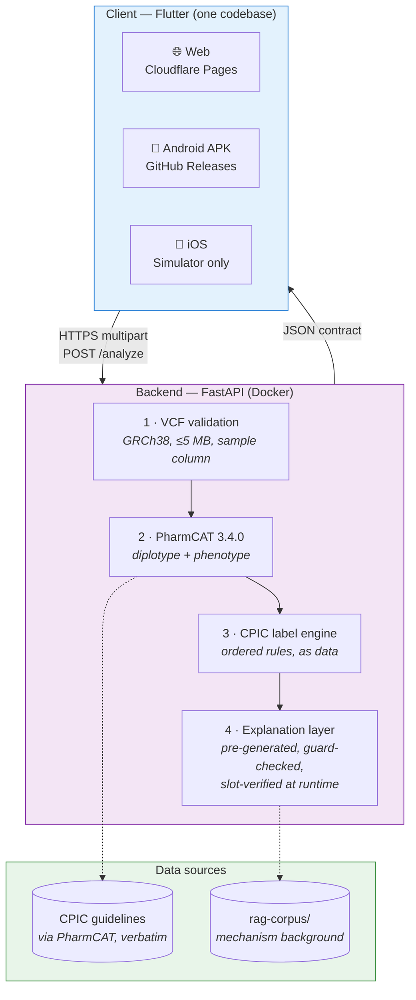
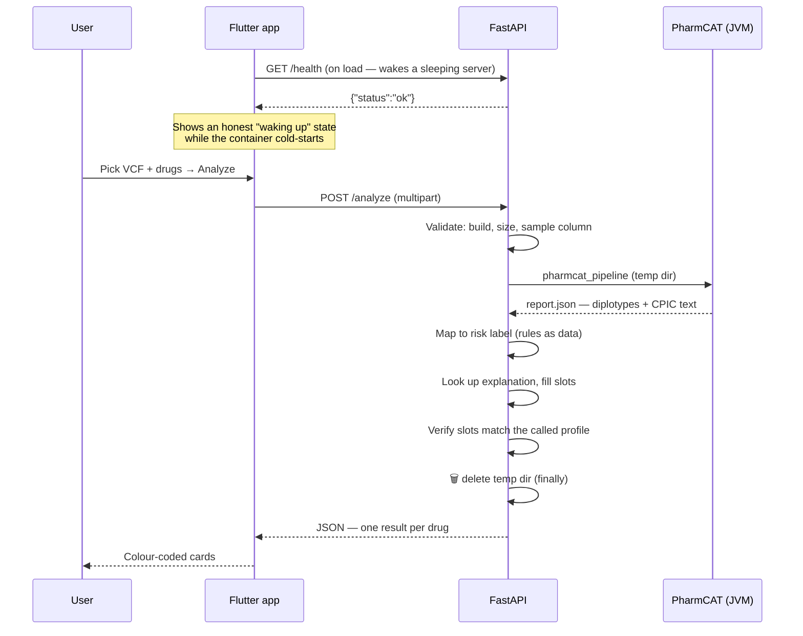

# 🧬 PharmaGuard

**Predict pharmacogenomic drug risk from a patient's VCF — genotypes called by
PharmCAT, clinical guidance quoted verbatim from CPIC, explanations grounded and
machine-checked.**

> ## ⚠️ Research/educational decision support only
> **Not a medical device. Not for clinical use.**
>
> This is a final-year student project. It has not been clinically validated and
> must not be used to make decisions about anyone's medication. Risk labels,
> phenotype calls and explanations may be wrong. Always consult a qualified
> healthcare professional.

---

## 🔗 Links

| | |
| --- | --- |
| 🌐 **Live demo** | `https://pharmaguard.pages.dev` — *placeholder, see [Deploying](#-deploying)* |
| ⚙️ **Backend API** | `https://YOURNAME-pharmaguard.hf.space` — *placeholder* |
| 📄 **API docs** | `<backend>/docs` (interactive OpenAPI) |
| 📱 **Android APK** | [Releases](https://github.com/YOURNAME/pharmaguard/releases) |
| 🎥 **Demo video** | *`<LinkedIn post URL — to be added>`* |

> **The links above are placeholders.** Deploying needs accounts only the project
> owner can create. Every step is written and verified against vendor docs in
> [`infra/DEPLOY_NOTES.md`](infra/DEPLOY_NOTES.md) — fill these in once you have
> run them.

---

## What it does

Upload a VCF, list the drugs you care about, get a per-drug risk card:

| Drug | Result | Why |
| --- | --- | --- |
| `clopidogrel` | 🔴 **Ineffective** (critical) | `CYP2C19 *2/*2` → poor metaboliser; the prodrug is never activated |
| `fluorouracil` | 🟠 **Adjust Dosage** (moderate) | `DPYD` variant carrier → reduced clearance |
| `simvastatin` | 🟢 **Safe** | `SLCO1B1 *1/*1` → normal transporter function |
| `codeine` | ⚪ **Unknown** | CYP2D6 is not callable from a VCF — and we say so rather than guessing |

Each card expands to show the diplotype, the detected variants, CPIC's own
recommendation text, and a plain-language explanation.

---

## 🏗 Architecture



### Request flow



**Design decision worth knowing:** explanations are **pre-generated offline**,
checked by a deterministic faithfulness guard, and served from a static file.
The explanation space is enumerable (6 drugs × ~6 phenotypes), so every string a
user can see is reviewable by a human *before* it ships — and the deployed path
needs **no API key and makes no outbound calls**.

Because that guard runs at build time, the patient-specific values filled in at
request time are cross-checked separately against the response's own profile —
see [How explanations are checked](#how-explanations-are-checked--precisely).

---

## 🛠 Tech stack

| Layer | Choice | Why |
| --- | --- | --- |
| **Backend** | Python 3.11, FastAPI, Pydantic v2 | Typed contract, free OpenAPI docs |
| **Genotyping** | PharmCAT 3.4.0 (pinned) | The reference open-source PGx caller |
| **Clinical source** | CPIC via PharmCAT, verbatim | We never write dosing text ourselves |
| **Explanations** | Pre-generated + guard; Gemini optional | Reviewable, and free to run |
| **Client** | Flutter 3.38 (web + Android + iOS) | One codebase, three targets |
| **Backend host** | Docker → Cloud Run / HF Spaces / Render | Same image runs on all three |
| **Web host** | Cloudflare Pages | Free, unlimited bandwidth |
| **CI/CD** | GitHub Actions | Free for public repos |

---

## 🚀 Run it locally

### Prerequisites

- Python 3.11, Flutter 3.38+
- **JDK 17** (Gradle does not support JDK 25 — see [DEPLOY_NOTES](infra/DEPLOY_NOTES.md))
- `bcftools` + `bgzip` for PharmCAT (`brew install bcftools htslib`)

### Backend

**With Docker** (brings PharmCAT with it — easiest):

```bash
docker compose -f infra/docker-compose.yml up --build
```

**Without Docker:**

```bash
cd backend
python3.11 -m venv .venv && source .venv/bin/activate
pip install -r requirements.txt

# PharmCAT is a Java app, not a pip package
pip install colorama 'pandas>=2.3.3' packaging
curl -LO https://github.com/PharmGKB/PharmCAT/releases/download/v3.4.0/pharmcat-pipeline-3.4.0.tar.gz
mkdir -p pharmcat && tar xzf pharmcat-pipeline-3.4.0.tar.gz -C pharmcat/
export PHARMCAT_PIPELINE="$PWD/pharmcat/pharmcat_pipeline"

uvicorn app.main:app --reload --port 8000
```

Check it: <http://localhost:8000/ready> — per-dependency status.

### Flutter app

```bash
cd app
flutter pub get
flutter run -d chrome                      # web
flutter run                                # connected Android/iOS device

# Point at a deployed backend instead of localhost:
flutter run -d chrome --dart-define=API_BASE_URL=https://YOURNAME-pharmaguard.hf.space
```

> **Android emulator:** `localhost` means the emulator. Use
> `--dart-define=API_BASE_URL=http://10.0.2.2:8000`.

---

## 📡 API

### `GET /health` — liveness

Deliberately trivial: no PharmCAT, no disk. This is the **wake-up ping** for a
sleeping free-tier container.

```bash
curl https://YOUR-BACKEND/health
```
```json
{ "status": "ok" }
```

### `GET /ready` — readiness

Verifies what `/analyze` actually needs. `200` when an analysis would work,
`503` otherwise, with a per-dependency breakdown.

```json
{
  "status": "ready",
  "checks": {
    "pharmcat":         { "ok": true, "detail": "'pharmcat_pipeline' on PATH" },
    "mechanism_corpus": { "ok": true, "detail": "6 mechanism document(s) loaded" },
    "explanations":     { "ok": true, "detail": "20 pre-generated (0 reviewed)" },
    "label_mapping":    { "ok": true, "detail": "label_mapping.yaml parsed" }
  },
  "explanation_mode": "static"
}
```

### `POST /analyze` — the analysis

`multipart/form-data`:

| Field | Type | Notes |
| --- | --- | --- |
| `file` | file | `.vcf` or gzip/bgzip `.vcf.gz`. **GRCh38 only**, ≤ 5 MB, ≥ 1 sample column |
| `drugs` | string | Comma-separated, e.g. `clopidogrel,fluorouracil` |

```bash
curl -F "file=@test-data/cyp2c19_poor_metabolizer.vcf" \
     -F "drugs=clopidogrel,codeine,aspirin" \
     https://YOUR-BACKEND/analyze
```

<details>
<summary><b>Response (abridged — click to expand)</b></summary>

```json
{
  "patient_id": "CYP2C19_POOR_METABOLIZER",
  "timestamp": "2026-07-23T04:12:07.481Z",
  "analyses": [
    {
      "drug": "clopidogrel",
      "risk_assessment": {
        "risk_label": "Ineffective",
        "confidence_score": 0.95,
        "severity": "critical"
      },
      "pharmacogenomic_profile": {
        "primary_gene": "CYP2C19",
        "diplotype": "*2/*2",
        "phenotype": "PM",
        "activity_score": null,
        "detected_variants": [
          {
            "rsid": "rs4244285",
            "gene": "CYP2C19",
            "genotype": "A/A",
            "star_allele": null,
            "function": "Contributes to named allele(s): *1, *2"
          }
        ]
      },
      "clinical_recommendation": {
        "action": "Avoid clopidogrel if possible. Use prasugrel or ticagrelor at standard dose if no contraindication.",
        "dosing_guidance": "Avoid clopidogrel if possible. Use prasugrel or ticagrelor at standard dose if no contraindication.",
        "cpic_recommendation": "CPIC strength of recommendation: Strong. Population: CVI ACS PCI. Implications: CYP2C19: Significantly reduced clopidogrel active metabolite formation…",
        "cpic_evidence_level": "Unknown",
        "alternatives": ["CPIC indicates an alternative drug is available — see the recommendation text above."],
        "source": "Annotation of CPIC Guideline for clopidogrel and CYP2C19 (via PharmCAT) [label rule: avoid_for_lack_of_efficacy]"
      },
      "llm_generated_explanation": {
        "summary": "clopidogrel: CYP2C19 *2/*2 (Poor Metabolizer) — Ineffective.",
        "mechanism": "CYP2C19 is a cytochrome P450 enzyme, expressed mainly in the liver…",
        "variant_rationale": "PharmCAT called CYP2C19 as *2/*2, which corresponds to a Poor Metabolizer result…",
        "patient_friendly": "Your genetic results suggest this medicine may not work as well for you as intended…",
        "disclaimer": "Research/educational decision support only. Not a medical device. Not for clinical use."
      }
    }
  ],
  "quality_metrics": {
    "vcf_parsing_success": true,
    "variants_detected_count": 4,
    "processing_time_ms": 1531,
    "warnings": [
      "explanation mode=static, source=static, guard=passed, reviewed=NO",
      "CYP2D6 structural/copy-number variation cannot be resolved from unphased VCF; outside diplotype input planned"
    ]
  }
}
```
</details>

**Every label is traceable.** `clinical_recommendation.source` names the CPIC
guideline *and* the mapping rule that produced the label.

### Errors

All failures return `detail` (human) and `error_code` (machine).

| Status | `error_code` | When |
| --- | --- | --- |
| 400 | `UNSUPPORTED_REFERENCE_BUILD` | GRCh37/hg19 uploaded |
| 400 | `NOT_VCF`, `EMPTY_FILE`, `NO_SAMPLE_COLUMN`, `NO_VARIANTS`, `CORRUPT_GZIP` | Not a usable VCF |
| 413 | `FILE_TOO_LARGE` | Over 5 MB |
| 422 | `NO_DRUGS`, `TOO_MANY_DRUGS` | Bad drug list |
| 429 | `RATE_LIMITED` | 10 analyses / 5 min / client |
| 503 | `PHARMCAT_UNAVAILABLE` | Backend dependency missing or timed out |

An unrecognised **drug** is never an error — it returns a well-formed `Unknown`.

---

## 🧪 Sample data

```
test-data/
├── cyp2c19_poor_metabolizer.vcf   CYP2C19 *2/*2  → clopidogrel Ineffective
├── dpyd_variant_carrier.vcf       DPYD *2A het   → fluorouracil Adjust Dosage
├── normal_metabolizer_control.vcf all reference  → everything Safe
└── generate_synthetic_vcf.py      build your own
```

```bash
python test-data/generate_synthetic_vcf.py --from-jar /pharmcat/pharmcat.jar --list CYP2C19

python test-data/generate_synthetic_vcf.py --definitions-dir definitions/ \
    --diplotype 'CYP2C19=*2/*2' \
    --pad-genes CYP2C19,CYP2C9,SLCO1B1,TPMT,NUDT15,DPYD \
    --sample MY_SAMPLE -o my_sample.vcf
```

> ⚠️ **A named allele is not one famous rsID.** Setting `rs4244285` to `1/1` and
> leaving CYP2C19's other 34 positions at reference produces **no call at all** —
> that combination matches no defined haplotype. The generator reads PharmCAT's
> own allele definitions for exactly this reason. See
> [`test-data/README.md`](test-data/README.md).

---

## 🔒 Data privacy

**No genomic data is retained. Ever.**

- The uploaded VCF is held **in memory** and written to a **per-request temp
  directory**, which is deleted in a `finally` block before the response is
  returned — on the success path *and* the crash path.
- Nothing genomic is logged, written to durable storage, or sent to any third
  party. The deployed backend makes **no outbound network calls at all**.
- No accounts, no cookies, no analytics, no tracking.
- The backend is stateless: restart it and nothing persists, because nothing was
  ever persisted.

### No patient genome ever reaches an LLM provider

The explanations are written by a language model, yet **no patient genomic data
is ever transmitted to that model — at build time or run time.** This is a
property of the architecture, not a promise:

- **Build time.** Explanations are pre-generated from *generic* cases: a
  `(gene, phenotype, drug)` triple plus the **published CPIC recommendation
  text**. Patient-specific values are placeholders (`{diplotype}`,
  `{detected_variants}`), because one reviewed sentence is reused for every
  patient sharing a phenotype. There is no patient at build time at all.
- **Run time.** The deployed service runs in **static mode**: it looks the
  pre-generated explanation up by `(drug, phenotype)` and fills the slots
  **locally**. It imports no provider SDK and opens no socket to any model. A
  real diplotype is substituted on the server and sent nowhere.

So the only text that ever leaves for a model is text that already exists in a
public CPIC guideline. This is what lets the system explain a genome without
becoming a way to leak one — and it is pinned by
[`test_privacy.py`](backend/tests/test_privacy.py), which checks every case's
actual model payload carries no diplotype, rsID, variant or activity score, and
that the static path reaches no provider even with every provider poisoned to
raise on contact.

This is asserted by tests, not just by policy —
[`test_deployment.py::TestNoDataRetention`](backend/tests/test_deployment.py)
checks the temp directory is empty after a real request **and** after a simulated
PharmCAT crash, and that no uploaded content is echoed back in the response.

> Still: this is a student project with no access control. **Do not upload real
> patient data.** Use the synthetic VCFs.

---

## ⚠️ Known limitations

| Limitation | Detail |
| --- | --- |
| **CYP2D6 is never called** | Its star alleles depend on copy-number variation a VCF cannot express. PharmCAT reports `callSource: NONE` even with all 157 positions present. Codeine returns `Unknown` with an explicit warning rather than a fabricated call. We deliberately do **not** enable PharmCAT's unvalidated `-research cyp2d6` mode |
| **GRCh38 only** | GRCh37/hg19 is rejected with a clear message. Liftover is out of scope — use CrossMap or Picard first |
| **Cold starts** | The backend sleeps when idle; the first request can take ~1 minute. The client shows an honest waking state with a progress bar |
| **`cpic_evidence_level` is always `Unknown`** | PharmCAT's report carries CPIC's *strength of recommendation*, not the A/B/C/D *level of evidence*. Inventing one would fabricate a clinical claim |
| **6 drugs** | clopidogrel, fluorouracil, azathioprine, simvastatin, warfarin, codeine. Warfarin returns `Unknown` — CPIC's guidance there is a dosing algorithm, not per-phenotype text |
| **Not clinically validated** | Synthetic VCFs prove the plumbing, not correctness. Validation against GeT-RM consensus genotypes is future work |
| **No clinical reviewer — declared, not pending** | This project has **no qualified clinical expert**, and will not get one. Rather than shipping unchecked prose, the system asserts no clinical content of its own: every sentence making a clinical claim is machine-verified to trace, word for word, to a CPIC recommendation issued by PharmCAT or to a cited mechanism document. `scripts/verify_provenance.py` enforces this as a release gate and CI runs it on every push. **20/20 entries pass.** What that establishes is that nothing was invented — *not* that a clinician agrees the text is correct. See [`reports/provenance_report.md`](reports/provenance_report.md) |
| **`Unknown` phenotype means two different things** | The contract has one value where the data has two states: **no result** (the gene was never called — coverage, missing data) and **indeterminate** (the gene *was* called, but the diplotype has no CPIC phenotype assignment). Clinically these are opposites — one is ignorance, the other is a finished assay CPIC's table cannot classify. A distinct enum value is the right fix; it is **deliberately deferred** because it changes the response contract, the Pydantic model, and the Dart client together. Until then `map_phenotype_noted()` surfaces PharmCAT's raw phenotype string in `quality_metrics.warnings`, so any reader can tell which state produced the `Unknown`. A warning is strictly weaker than a typed field — a client cannot branch on it — and that is exactly why this is listed as a limitation rather than a solution. `test_phenotype_table.py` pins the deferral: adding the enum value fails a test whose message names every doc that must change with it |
| **Rate limit is in-memory** | Resets on restart; keyed on a spoofable header. Abuse dampening, not a security boundary |

---


### Field authorship — who writes what

Not everything in an explanation has the same author, and conflating them was a
real defect: a prose model asked to emit `{diplotype}` templating complied 4
times in 14, leaving ten entries unable to show the patient's genotype.

| Field | Author | Guarantee |
| --- | --- | --- |
| `clinical_recommendation` | **PharmCAT / CPIC, verbatim** | Byte-identical to the guideline text. Never model-authored. |
| `variant_rationale` | **Composed by code** at request time from that response's own PharmCAT profile | Always present, always agrees with the reported genotype — structurally, not by instruction |
| `summary`, `mechanism`, `patient_friendly` | LLM (`meta/llama-3.1-8b-instruct`), genotype-agnostic | May not name a diplotype or emit placeholders; every clinical assertion must trace to a cited source |

### What the automated checks can and cannot do

Measured, not asserted — see `reports/provenance_finding.md`:

- Entity guard catches fabricated doses, genes, rsIDs, star alleles.
- Assertion checking catches invented quantities and timelines, but is
  **structurally blind to a fabricated mechanism** ("inhibited by grapefruit
  juice" contains no number and no unknown concept).
- Polarity checking catches negation reversal in both directions.
- Closed-vocabulary checking on mechanism text detects foreign entities but had a
  **57% false-positive rate** on real prose (30% after narrowing to concrete
  nouns), so it is **retired from the gate** and reports only.

**No combination of these certifies that a sentence is clinically correct.** They
are triage. The release gate is human adjudication of every shipped sentence, and
every mechanism sentence requires an individual decision. Adjudication is the
project author checking prose against its cited source — **not clinical expert
review**, which this project has never had and does not claim.

---

## 🧭 Project phases

| Phase | Scope | Status |
| --- | --- | --- |
| 1 | FastAPI ↔ Flutter seam, JSON contract, stub analyzer | ✅ |
| 2 | VCF validation → PharmCAT → CPIC label mapping | ✅ |
| 3 | Mechanism corpus, pre-generated explanations, faithfulness guard | ✅ |
| 4 | Deployment, cold-start resilience, security hardening, APK | ✅ |
| 5 | Outside CYP2D6 diplotype input | 🔜 |
| 6 | Validation against GeT-RM / 1000 Genomes | 🔜 |

---

## ✅ Tests

```bash
cd backend && pip install -r requirements-dev.txt && pytest   # 305 passed, 4 skipped
cd app     && flutter test && flutter analyze                 # 21 tests
```

Backend tests need **no PharmCAT, Java, Docker or API key** — they run against
checked-in PharmCAT fixtures. The static-mode test actively poisons the LLM
generator, so a regression that reintroduced a network call in the default path
fails the build rather than surfacing at deploy time.

### How explanations are checked — precisely

Two different checks run at two different times. Stating this accurately
matters, because "guard-checked" is easy to read as more than it is.

**1. Faithfulness guard — build time.**
`backend/app/explanation/guard.py` rejects any number, dose, rsID, star allele,
gene or drug name that is not present in the supplied context. In `static` mode
it runs during `scripts/pregenerate_explanations.py`, over prose that still
contains `{diplotype}`-style placeholders; the verdict is stored and replayed at
request time. In `live` mode it runs per request, with one retry.

It does **not** check semantics — it cannot tell that "reduced CYP2C19 function
causes the drug to accumulate" is backwards, because every token in that
sentence is in the context. It catches fabricated entities; wrong reasoning is
what corpus review is for.

**2. Slot verification — request time.**
The build-time verdict says nothing about the patient-specific values injected
into those placeholders, because they are filled per request, long after. So
`backend/app/explanation/slot_verifier.py` re-derives what each slot should have
become from the response's own `pharmacogenomic_profile` — the object rendered
in the card directly above the explanation — and confirms the filled text
contains it. On a mismatch the result is demoted to the deterministic template
and a warning appears in `quality_metrics`; a mismatched explanation is never
served.

Every response reports both, e.g.
`explanation mode=static, source=static, guard=passed, slots=verified,
provenance=verified`.

So: **static mode is build-time guarded, runtime slot-verified, and
provenance-verified sentence by sentence.**

None of the three makes any claim about clinical *correctness*. A sentence
assembled entirely from source words can still describe a mechanism backwards,
and no check here would notice. Catching that needs a clinician, and this
project has none — so the guarantee is stated in the narrower terms that are
actually true rather than in terms of a review that was never going to happen.

---

## 📦 Deploying

Everything is written and ready; deploying needs your own accounts. Full verified
steps: **[`infra/DEPLOY_NOTES.md`](infra/DEPLOY_NOTES.md)**.

> **⚠️ Hugging Face Docker Spaces are no longer free** — HF now requires a PRO
> plan for Docker/Gradio Spaces (verified 2026-07-23). `infra/DEPLOY_NOTES.md`
> compares genuinely-free alternatives; **Google Cloud Run** is recommended, and
> the same image runs on all of them because the container honours `$PORT`.

| Piece | Where | Workflow |
| --- | --- | --- |
| Backend | Cloud Run / HF Spaces / Render | `infra/Dockerfile` |
| Web | Cloudflare Pages | `.github/workflows/deploy-web.yml` |
| APK | GitHub Releases | `.github/workflows/build-apk.yml` |
| Warm-up | GitHub Actions cron | `.github/workflows/keepalive.yml` |

---

## 👥 Team

| Role | Name |
| --- | --- |
| Developer | *`<your name>`* |
| Developer | *`<team member>`* |
| Project guide | *`<guide name>`* |
| Institution | *`<institution>`* |

> Fill these in before submission. The label mapping and all explanations also
> need the project guide's sign-off — see
> [`backend/app/data/label_mapping.yaml`](backend/app/data/label_mapping.yaml)
> and [`scripts/README.md`](scripts/README.md).

---

## 📄 Licence

[MIT](LICENSE), with an explicit not-a-medical-device notice.

PharmaGuard invokes **PharmCAT** (MPL-2.0) as a separate process. Clinical text
originates from **CPIC** and is reproduced via PharmCAT's output — consult
<https://cpicpgx.org/> before redistributing it.

---

<div align="center">

**Research/educational decision support only. Not a medical device. Not for clinical use.**

</div>
